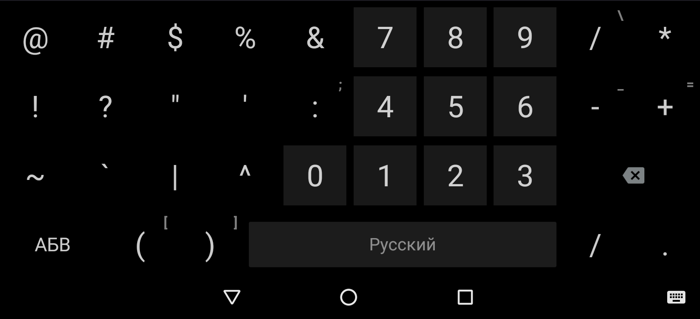

# Simple Keyboard Forked

Forked from https://github.com/rkkr/simple-keyboard
I want to add a few extra nice little things and learn some programming on Andriod.  
  
  
Я хочу добавить несколько дополнительных приятных мелочей и подучиться в программировании на Andriod.  
 
### Что я хотел бы видеть в программе

- [x] Определение напревления свайпа
  - [x] Свайп вверх
    - [x] Печать заглавной буквы
    - [ ] Всплывающая посказка вводимого символа
  - [x] Свайп вниз
    - [x] Печать дополнительного символа
    - [ ] Перенос меню дополнительных клавиш с возможностью выбора клавиши
    - [ ] Всплывающая посказка вводимого символа
- [X] Переделать некоторые шаблоны клавиатур
  - [X] Шаблон Т9 для цифровой клавиатуры
    - [ ] Выднлить некоторые символы
  - [ ] Дополнительные символы в шаблонах клавиатур с цифровой панелью

# Original README from rkkr/simple-keyboard
Forked from https://android.googlesource.com/platform/packages/inputmethods/LatinIME/

You can contribute to translate the project to your language: 

